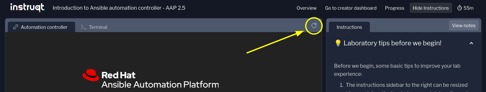

= Lab Guide: Creating a Job Template with a Survey
:notoc:
:toc-title: Table of Contents
:sectnums:
:icons: font

_A guide to creating a fourth Job Template for installing Apache, this time including a Survey to pass variables at runtime._

---

== Lab Briefing

In the automation controller, **job templates** are a visual representation of the `ansible-playbook` command and all the flags you can use when executing from the command line. They are the primary mechanism for running your Ansible Playbooks.

image::../assets/images/job-templates-home-with-example-job-template.png[Job Templates list view in automation controller, opts="border"]

---

== Lab Guide: Hands-On Tasks

In this challenge, you will explore the **Survey** feature. Surveys allow you to prompt for user input when a Job Template is launched, making it possible to change a parameter or setting for each run. You will use a survey to customize the `index.html` file deployed by the Apache playbook.

[IMPORTANT]
====
Reminder that the credentials to log in to the automation controller are:

* *Username:* `admin`
* *Password:* `ansible123!`
====

=== Task 1: Create the Job Template

First, you will create a new job template that uses a playbook designed to work with a survey variable.

. **Navigate to the Templates page.**
+
In the left navigation menu, go to **Automation Execution** → **Templates**.

. **Create a new job template.**
+
**Click** the blue **Create template** button and select **Create job template**.

. **Enter the job template details.**
+
Fill out the form with the following information:
+
* **Name:** `Install Apache with Survey`
* **Job Type:** `Run`
* **Inventory:** `Lab-Inventory`
* **Project:** `Apache playbooks`
* **Playbook:** `apache_template.yml`
* **Credentials:** Select `lab-credentials`.
* **Privilege Escalation:** **Check** this box to enable `become`.

. **Save the job template.**
+
Leave all other fields as they are and **click** the blue **Create job template** button.

=== Task 2: Create the Survey

Now you will add a survey to the job template to ask for a user's name.

. **Navigate to the Survey tab.**
+
Once the Job Template is saved, you will be on its *Details* page. **Click** the **Survey** tab.

. **Create a new survey question.**
+
**Click** the blue **Create survey question** button.

. **Configure the survey question.**
+
Fill out the form with the following details:
+
--
* **Question:** `What is your name, fellow student?`
* **Description:** `Enter your name or nickname to see it work!`
* **Answer variable name:** `student_name`
* **Answer type:** `Text` (default)
* **Required:** Make sure this is **NOT** checked.
* **Default answer:** `Skippy`
--

. **Save the survey question.**
+
**Click** the blue **Create survey question** button at the bottom.

. **Enable the survey.**
+
On the Survey tab, you will now see a toggle that reads **Survey disabled**. **Click** this toggle to **enable** the survey.

=== Task 3: Launch the Template and Use the Survey

Finally, launch the template and provide a custom value through the survey.

. **Launch the template.**
+
**Click** the **Launch template** button at the top of the `Install Apache with Survey` job template screen.

. **Answer the survey question.**
+
A survey prompt will appear. **Delete** the default answer (`Skippy`) and **enter your own name**.

. **Launch the job.**
+
**Click** the **Next** button, review the details, and then **click** the **Finish** button to launch the job.

. **Verify the result.**
+
Once the job completes successfully, **navigate** to the **Node1 Web** tab at the top of the lab screen. You may need to refresh the page. You should see the Apache message with your name displayed below it!
+

---

== Congratulations!

You have finished the lab successfully! 🎉

[IMPORTANT]
====
Remember to press the green **Check**, **Next**, or **Skip** button below to complete the lab. We appreciate all feedback!
====

=== Claim Your Badge

Scan the following QR code to claim your Ansible Forum badge for completing the lab:

image::../assets/May-13-2025_at_21.28.27-image.png[QR code for Ansible Forum badge, opts="border"]

If you don't have an Ansible Forum account yet, no worries! You can sign up using the same link. To keep it simple, you can register or log in with your Google or GitHub account, and an account will be created for you automatically.

Once you sign up, remember to introduce yourself in link:https://forum.ansible.com/t/introduce-yourself-2025-edition/39892[this Forum topic]!

---

== Troubleshooting

If you have encountered an issue or have noticed something not quite right, please link:https://github.com/ansible/instruqt/issues/new?labels=intro-to-controller&title=Issue+with+Intro+to+Controller+slug+ID:+controller-101-template&assignees=leogallego[open an issue on GitHub].
